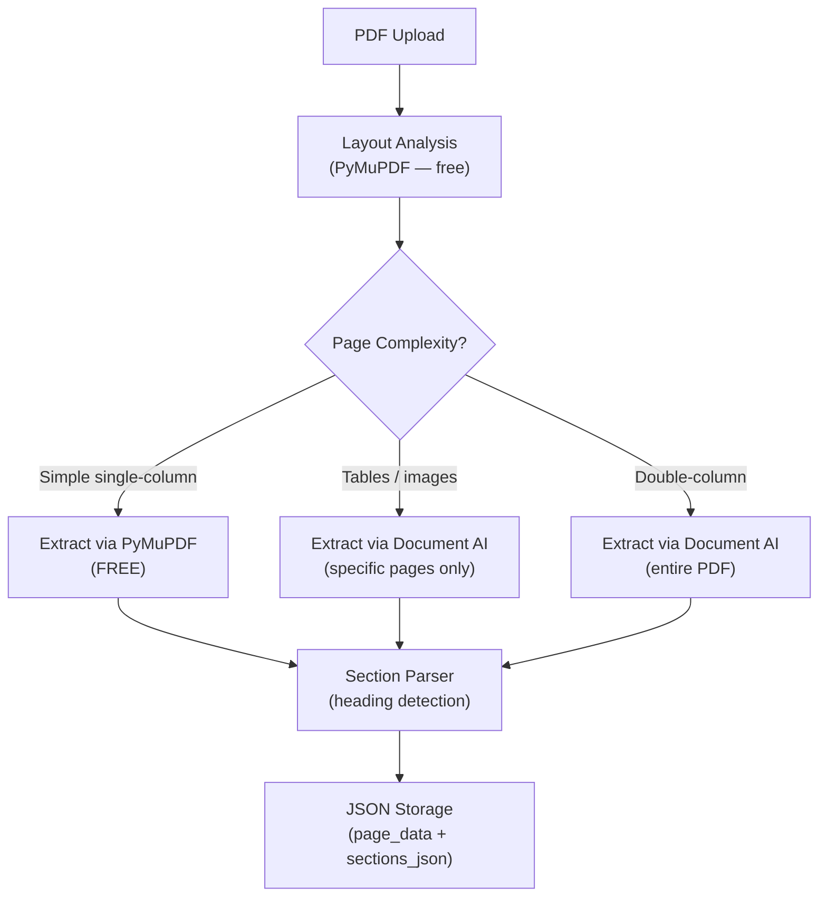
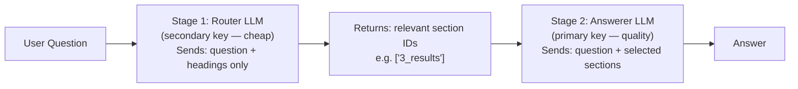

# Smart Research Assistant — Project Progress Report

> **Last Updated:** 2026-02-21  
> **Status:** Backend 100% ✅ | Frontend ~60% 🟡

---

## Backend — 100% Complete ✅

### Architecture Overview

```
.env                    ← API keys (primary + router LLM, Document AI)
backend/
├── __init__.py
├── config.py           ← Settings loader (.env → Pydantic model)
├── models.py           ← All Pydantic models (Paper, PageAnalysis, etc.)
├── storage.py          ← SQLite + JSON storage (Firestore-ready)
├── pdf_analyzer.py     ← Local layout analysis (PyMuPDF)
├── docai.py            ← Google Document AI client
├── section_parser.py   ← Heading detection → named sections
├── extraction_pipeline.py ← Orchestrator (PyMuPDF + DocAI + sections)
├── llm_client.py       ← Two-stage LLM (router + answerer)
├── main.py             ← FastAPI endpoints
├── requirements.txt    ← All Python dependencies
└── service-account.json ← Google Cloud credentials (gitignored)
```

### Processing Pipeline



### Two-Stage LLM Pipeline



**Why two-stage?** Router call uses ~200 tokens (only headings). Answerer gets only the relevant sections. A 23-page paper might only send 1-2 sections instead of the full text.

### API Endpoints — All Functional

| Method | Endpoint | Purpose | Status |
|--------|----------|---------|--------|
| `GET` | `/api/health` | Health check — shows DocAI, LLM, router status | ✅ |
| `GET` | `/api/papers` | List all uploaded papers | ✅ |
| `POST` | `/api/papers/upload` | Upload PDF — runs extraction + section parsing | ✅ |
| `GET` | `/api/papers/{id}` | Paper details + analysis + sections summary | ✅ |
| `GET` | `/api/papers/{id}/sections` | All parsed sections with char counts | ✅ |
| `GET` | `/api/papers/{id}/pages/{num}` | Individual page data + extraction method | ✅ |
| `POST` | `/api/chat` | Two-stage chat (router → select sections → answer) | ✅ |
| `GET` | `/api/papers/{id}/updates` | Get paper updates/news | ✅ |
| `POST` | `/api/papers/{id}/updates/{uid}/summarize` | LLM-powered update summary | ✅ |
| `POST` | `/api/papers/{id}/report` | LLM-powered structured report generation | ✅ |
| `POST` | `/api/credits/deduct` | Deduct credits | ✅ |
| `POST` | `/api/credits/purchase` | Purchase credits | ✅ |

### Storage Schema (SQLite, JSON-ready for Firestore)

**papers table:**
- `paper_id` — unique identifier
- `paper_json` — serialized Paper model (title, authors, abstract, etc.)
- `extracted_text` — full combined text
- `file_path` — path to stored PDF
- `page_data` — JSON: per-page text, extraction method, column info
- `analysis_json` — JSON: layout analysis results
- `sections_json` — JSON: parsed sections (abstract, headings, section text)

**credits table:**
- Single-row balance tracker. Default: 100 credits.

### Key Backend Features

1. **Hybrid extraction:** PyMuPDF (free) for simple pages, Document AI (paid) only for complex pages → 43% cost savings on a 23-page paper
2. **Section parsing:** Detects numbered headings, keyword headings, ALL-CAPS headings → splits paper into named sections
3. **Two-stage LLM:** Router (cheap) picks relevant sections → Answerer (quality) uses only those sections
4. **Context truncation:** 6000 char limit prevents token overflow on free-tier LLMs
5. **Auto-batching:** PDFs >15 pages are chunked into batches for Document AI
6. **JSON-first storage:** All complex data stored as JSON blobs → ready for Firestore migration
7. **Provider-agnostic LLM:** Supports Groq, OpenAI, and Gemini via config
8. **Report generation:** Real LLM-powered structured reports (not stubs)
9. **Error handling:** Proper 400/402/404/500 responses for all edge cases

### .env Configuration

```
DOC_AI_PROJECT_ID=...
DOC_AI_LOCATION=us
DOC_AI_PROCESSOR_ID=...
GOOGLE_APPLICATION_CREDENTIALS=./backend/service-account.json
LLM_PROVIDER=groq
LLM_API_KEY=...                # Primary (answers questions)
LLM_MODEL=llama-3.1-8b-instant
LLM_ROUTER_API_KEY=...         # Router (picks sections)
LLM_ROUTER_MODEL=llama-3.1-8b-instant
```

### Test Results (46/46 passed ✅)

All endpoints tested with a real 23-page research paper:
- Health, list, upload, details, sections, pages, chat, report, credits, error handling — all pass

---

## Frontend — ~60% Complete 🟡

### Tech Stack
- React 18 + TypeScript + Vite
- Framer Motion (animations)
- Lucide Icons
- React Hot Toast (notifications)
- React Router DOM

### Existing Pages & Components

| File | Purpose | Status |
|------|---------|--------|
| `App.tsx` | Router: Landing → Dashboard → PaperDetail → Usage | ✅ Working |
| `pages/Landing.tsx` | Landing page with upload | ✅ Working |
| `pages/Dashboard.tsx` | Paper list + sidebar | ✅ Working |
| `pages/PaperDetail.tsx` | Chat interface + paper viewer | 🟡 Needs fixes |
| `pages/Usage.tsx` | Credits usage tracking | ✅ Working |
| `components/Chat/` | Chat UI (messages, input, bubbles) | 🟡 Needs polish |
| `components/Upload/` | File upload modal | ✅ Working |
| `components/Paper/` | Paper card component | ✅ Working |
| `components/Updates/` | Updates panel | 🟡 Stub data |
| `components/Layout/` | Page layout wrapper | ✅ Working |
| `services/backendApi.ts` | API client matching all backend endpoints | ✅ Working |
| `services/apiClient.ts` | Fetch wrapper with error handling | ✅ Working |
| `services/creditsService.ts` | Credits management | ✅ Working |
| `context/AppContext.tsx` | Global state management | ✅ Working |
| `types/index.ts` | TypeScript types for all models | ✅ Working |

### Frontend Tasks Remaining

1. **Paper persistence:** Papers reset on refresh — need to call `GET /api/papers` on app load to restore state
2. **PaperDetail fixes:** Wire the sections/analysis data from new backend endpoints into the detail view
3. **Report display:** Report generation button exists but needs proper markdown rendering for the LLM-generated report
4. **Updates panel:** Currently uses stub data — needs to display real updates or be adapted
5. **Chat UX polish:** Style improvements, loading states during two-stage routing
6. **API base URL:** Set `VITE_API_BASE_URL=http://localhost:8000/api` in frontend `.env` or proxy config
7. **Responsive design:** Test and fix mobile/tablet views
8. **New endpoint usage:** `backendApi.ts` doesn't yet call `GET /api/papers` or `GET /api/papers/{id}/sections` — needs those added

### How to Start Development

```bash
# Backend (from project root)
uvicorn backend.main:app --port 8000 --reload

# Frontend (from frontend/)
npm run dev
```

Frontend runs on `http://localhost:5173`, backend on `http://localhost:8000`.

---

## Deployment Checklist (Future)

- [ ] Set up Firestore and migrate storage.py
- [ ] Deploy backend to Cloud Run / App Engine
- [ ] Deploy frontend to Vercel / Firebase Hosting
- [ ] Move service-account.json to Cloud Run secrets
- [ ] Set environment variables in production
- [ ] Configure CORS for production domain
