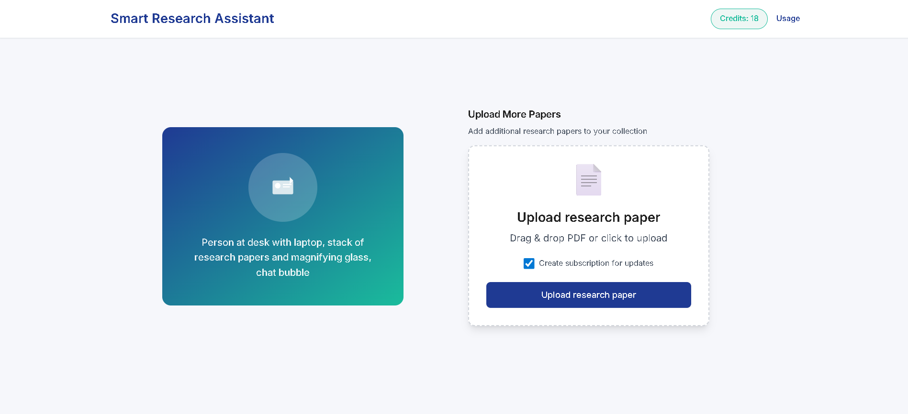
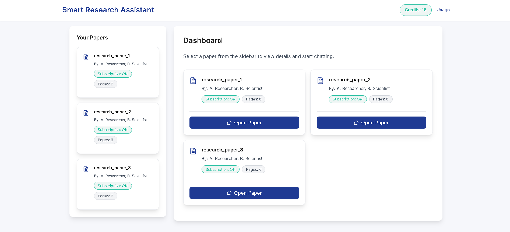
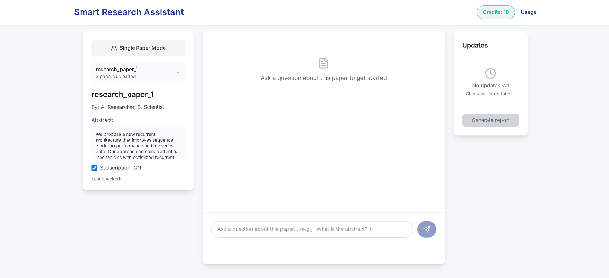
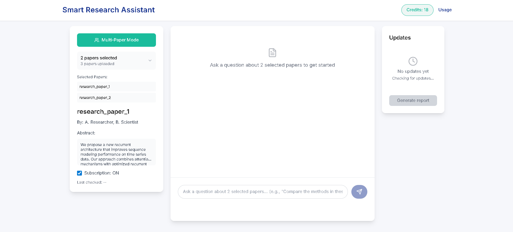
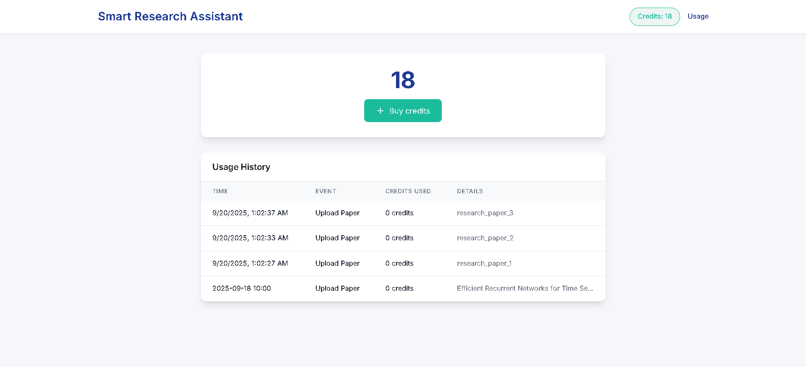
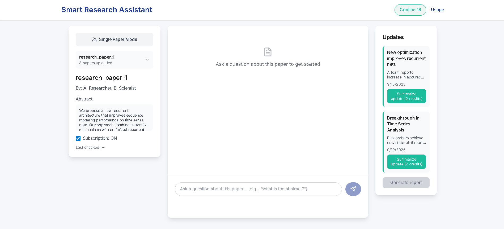

# Smart Research Assistant 🧠📚

An AI-powered research paper analysis platform that transforms how researchers interact with academic literature. Upload multiple papers, ask intelligent questions, and get comprehensive answers with proper citations and real-time updates.

## 🚀 **What Makes This Special?**

### **Multi-Paper Intelligence**
- **Upload Multiple Papers**: Add as many research papers as you need
- **Cross-Paper Analysis**: Ask questions that span across multiple papers
- **Comparative Insights**: Get AI-powered comparisons between different research approaches
- **Smart Citations**: Every answer includes proper citations from relevant papers

### **Real-Time Research Updates**
- **Live News Monitoring**: Automatically tracks new developments related to your papers
- **Intelligent Summarization**: Get AI summaries of new research (2 credits each)
- **Keyword Matching**: Updates are filtered based on your paper's research topics

### **Intelligent Chat System**
- **Two Modes**: Single paper focus or multi-paper analysis
- **Context-Aware Responses**: AI understands which papers you're discussing
- **Credit System**: Transparent usage tracking with visual feedback
- **Citation Modals**: Click any citation to see detailed snippets

## 🎯 **Key Features**

### **📄 Paper Management**
- Drag & drop PDF upload
- Multiple paper support
- Paper metadata display
- Subscription management

### **💬 Intelligent Chat**
- Single paper Q&A mode
- Multi-paper comparison mode
- Real-time response generation
- Smart citation system

### **📰 Live Updates**
- Automatic news monitoring
- Research trend tracking
- AI-powered summarization
- Update notifications

### **📊 Usage Analytics**
- Credit tracking system
- Detailed usage logs
- Cost transparency
- Purchase credits

## 🛠️ **Technology Stack**

- **Frontend Framework**: React 18 + TypeScript
- **Styling**: Tailwind CSS + Framer Motion
- **State Management**: React Context API
- **Routing**: React Router DOM
- **Icons**: Lucide React
- **Build Tool**: Vite
- **Package Manager**: npm
- **Data**: Demo data simulation for interactive experience

## 🚀 **Installation**

### **Prerequisites**
- Node.js 16+ 
- Python 3.8+
- API keys configured in `.env` file

### **Setup**

1. **Clone the repository**
   ```bash
   git clone https://github.com/udaykumar0515/Smart-Research-Assistant.git
   cd Smart-Research-Assistant
   ```

2. **Backend Setup**
   ```bash
   pip install -r backend/requirements.txt
   # Configure .env with your API keys
   uvicorn backend.main:app --port 8000 --reload
   ```

3. **Frontend Setup**
   ```bash
   cd frontend
   npm install
   npm run dev
   ```

4. **Access the application**
   - Frontend: http://localhost:5173
   - Backend API: http://localhost:8000

## 📱 **How to Use**

### **1. Upload Papers**
- Go to the landing page
- Drag & drop PDF files or click to select
- Upload as many papers as needed
- Each paper gets a unique ID and metadata

### **2. Start Chatting**
- Click "View Dashboard" to see all papers
- Select a paper to start single-paper chat
- Toggle "Multi-Paper Mode" for cross-paper analysis
- Ask questions like:
  - "What is the main contribution of this paper?"
  - "Compare the methods used in these papers"
  - "Which paper has better results?"

### **3. Explore Updates**
- Check the Updates panel for new research
- Click "Summarize update" for AI summaries
- Track your credit usage in real-time

## 🎨 **Screenshots**

*Visual demonstration of the Smart Research Assistant interface*


**Landing Page** - Clean, modern interface with drag-and-drop upload functionality and professional navigation bar

---


**Dashboard** - Professional grid layout showing all uploaded papers with selection states and navigation options

---


**Chat Interface** - Interactive chat showing user questions, AI responses with citation chips, and paper metadata

---


**Multi-Paper Mode** - Paper selector with checkboxes, selected papers list, and comparative chat responses

---


**Usage Analytics** - Clean analytics dashboard showing credit usage, transaction logs, and purchase options

---


**Updates Panel** - Real-time updates section showing new research, summarization buttons, and credit costs

## �️ **Architecture**

### **Backend (FastAPI)**
- **PDF Processing**: Hybrid extraction (PyMuPDF + Google Document AI)
- **AI Pipeline**: Two-stage LLM for cost-efficient analysis
- **Storage**: SQLite with JSON serialization (Firestore-ready)
- **API**: 11 RESTful endpoints with comprehensive error handling

### **Frontend (React)**
- **Modern Stack**: React 18 + TypeScript + Tailwind CSS
- **State Management**: React Context API
- **UI Components**: Framer Motion animations, Lucide icons
- **Real-time**: WebSocket-ready for live updates

## 📄 **License**

This project is licensed under the MIT License.

---

**Built with ❤️ for the research community**