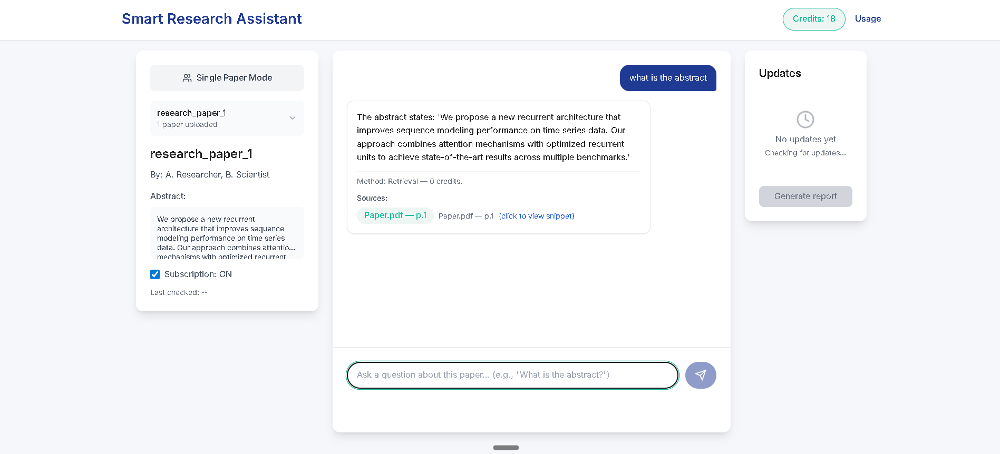

# Smart Research Assistant 🧠📚

> **HackWithHyderabad Hackathon 2025 Submission**

A revolutionary AI-powered research paper analysis platform that transforms how researchers interact with academic literature. Upload multiple papers, ask intelligent questions, and get comprehensive answers with proper citations and real-time updates.

> **⚠️ Note: This is a frontend prototype/mockup demonstrating the user experience. All AI responses, paper processing, and backend functionality are simulated using mock data.**

## 🚀 **What Makes This Special?**

### **Multi-Paper Intelligence**
- **Upload Multiple Papers**: Add as many research papers as you need
- **Cross-Paper Analysis**: Ask questions that span across multiple papers
- **Comparative Insights**: Get AI-powered comparisons between different research approaches
- **Smart Citations**: Every answer includes proper citations from relevant papers

### **Real-Time Research Updates**
- **Live News Monitoring**: Automatically tracks new developments related to your papers
- **Intelligent Summarization**: Get AI summaries of new research (2 credits each)
- **Keyword Matching**: Updates are filtered based on your paper's research topics

### **Intelligent Chat System**
- **Two Modes**: Single paper focus or multi-paper analysis
- **Context-Aware Responses**: AI understands which papers you're discussing
- **Credit System**: Transparent usage tracking with visual feedback
- **Citation Modals**: Click any citation to see detailed snippets

## 🎯 **Key Features**

### **📄 Paper Management**
- Drag & drop PDF upload
- Multiple paper support
- Paper metadata display
- Subscription management

### **💬 Intelligent Chat**
- Single paper Q&A mode
- Multi-paper comparison mode
- Real-time response generation
- Smart citation system

### **📰 Live Updates**
- Automatic news monitoring
- Research trend tracking
- AI-powered summarization
- Update notifications

### **📊 Usage Analytics**
- Credit tracking system
- Detailed usage logs
- Cost transparency
- Purchase credits

## 🛠️ **Technology Stack**

- **Frontend Framework**: React 18 + TypeScript
- **Styling**: Tailwind CSS + Framer Motion
- **State Management**: React Context API
- **Routing**: React Router DOM
- **Icons**: Lucide React
- **Build Tool**: Vite
- **Package Manager**: npm
- **Data**: Mock data simulation (no backend)

## 🚀 **Getting Started**

### **Prerequisites**
- Node.js 16+ (for running the development server)
- npm (included with Node.js)

### **Installation**

1. **Clone the repository**
   ```bash
   git clone https://github.com/udaykumar0515/Smart-Research-Assistant.git
   cd Smart-Research-Assistant
   ```

2. **Install dependencies**
   ```bash
   cd frontend
   npm install
   ```

3. **Start development server**
   ```bash
   npm run dev
   ```

4. **Open in browser**
   ```
   http://localhost:5173
   ```

## 📱 **How to Use**

### **1. Upload Papers**
- Go to the landing page
- Drag & drop PDF files or click to select
- Upload as many papers as needed
- Each paper gets a unique ID and metadata

### **2. Start Chatting**
- Click "View Dashboard" to see all papers
- Select a paper to start single-paper chat
- Toggle "Multi-Paper Mode" for cross-paper analysis
- Ask questions like:
  - "What is the main contribution of this paper?"
  - "Compare the methods used in these papers"
  - "Which paper has better results?"

### **3. Explore Updates**
- Check the Updates panel for new research
- Click "Summarize update" for AI summaries
- Track your credit usage in real-time

## 🎨 **Screenshots**

*Visual demonstration of the Smart Research Assistant interface*


**Landing Page** - Clean, modern interface with drag-and-drop upload functionality and professional navigation bar

---


**Dashboard** - Professional grid layout showing all uploaded papers with selection states and navigation options

---


**Chat Interface** - Interactive chat showing user questions, AI responses with citation chips, and paper metadata

---


**Multi-Paper Mode** - Paper selector with checkboxes, selected papers list, and comparative chat responses

---


**Usage Analytics** - Clean analytics dashboard showing credit usage, transaction logs, and purchase options

---


**Updates Panel** - Real-time updates section showing new research, summarization buttons, and credit costs

## 🏆 **HackWithHyderabad Hackathon**

This project was developed for **HackWithHyderabad 2025**, focusing on:

- **Innovation**: Revolutionary approach to research paper analysis
- **User Experience**: Intuitive interface for non-technical users
- **Scalability**: Multi-paper support for comprehensive research
- **AI Integration**: Smart responses with proper citations
- **Real-time Features**: Live updates and trend monitoring

## 🔮 **Planned Development (Not Yet Implemented)**

### **Phase 1: Backend Integration**
- [ ] Real PDF processing and text extraction
- [ ] AI model integration for actual paper analysis
- [ ] User authentication and data persistence
- [ ] Real-time news API integration

### **Phase 2: Advanced Features**
- [ ] Paper recommendation system
- [ ] Collaborative research workspaces
- [ ] Export functionality (PDF reports)
- [ ] Advanced search and filtering

### **Phase 3: Enterprise Features**
- [ ] Team collaboration tools
- [ ] Institutional subscriptions
- [ ] Advanced analytics dashboard
- [ ] API for third-party integrations


## 📄 **License**

This project is licensed under the MIT License 

## 👥 **Team**

- **H. UdayKumar** - Lead Developer & Project Manager
- **P. Venkata Teja** - Frontend Developer ([GitHub](https://github.com/VenkataTejaP9587)) | venkatatejapatnam@gmail.com
- **S. Sairam** - UI/UX Designer ([GitHub](https://github.com/sairamshivva)) | sairamshivva@gmail.com
- **K. Bhanu** - Research & Support ([GitHub](https://github.com/BUNNY5S)) | bhanubunny2030@gmail.com
- **M. Madhan** - Research & Support | mekalamadhan8@gmail.com

## 📞 **Contact**

- **GitHub**: [@udaykumar0515](https://github.com/udaykumar0515)
- **Project**: [Smart Research Assistant](https://github.com/udaykumar0515/Smart-Research-Assistant)

---

**Built for the research community**

*Frontend prototype demonstrating intelligent AI assistance for academic research*
